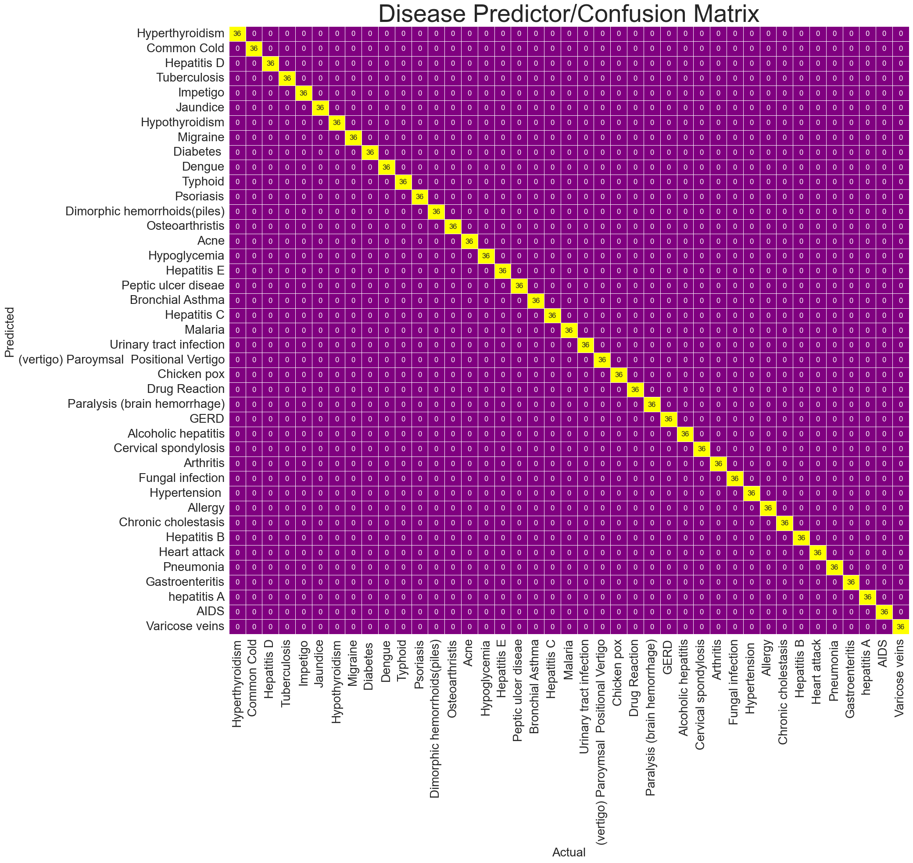

# Assignment-2

# Visualization 
The visualization which was chosen to display the prediction of the viruses within the dataset is a confusion matrix . This visualization was choosen because it is believed that it  would be the most appropriate chart to depict the accuracy of the classification prediction of the data set as it displays clearly the actual viruses compared to the predicted virus which was ascertained through the utilization of  pycaret 

# Dataset 
The dataset which was used lists 41 unique diseases and there 17 symptoms. In order to create the confusion matrix it was decided upon that the targeted field or the field to be predicted which would be used is the disease field . 

# Visualization 
The image below depicts what the final output of the visualization will look like 

# Technology Used 
* ***Matplotlib***
* ***scikit-learn***
* ***Seaborn***
